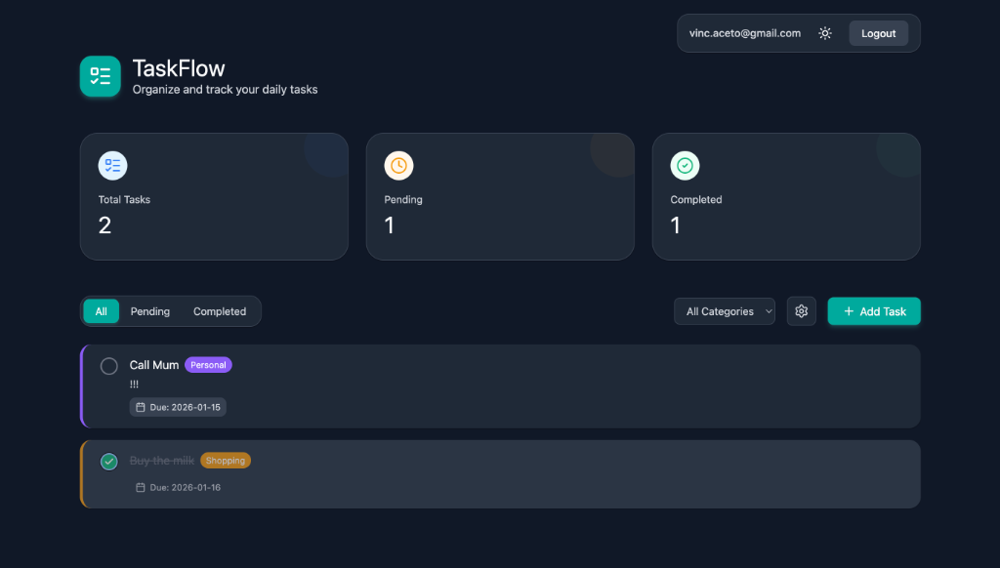

# TaskFlow - Modern Task Management App

TaskFlow is a sleek, modern task management application designed to help users organize their daily lives with efficiency and style. Built from scratch with a focus on user experience, it combines a beautiful, responsive interface with robust cloud synchronization.




### 🚀 **[Live Demo](https://taskflow-aceto-2026.web.app)**
Check out the live version of the app hosted on Firebase!

## 💡 The Idea
The goal was to create a Todo app that didn't feels like a utility, but like a premium productivity tool. We wanted to move away from generic designs and build something that feels "alive" — with smooth animations, semantic theming (perfect dark mode!), and a "Nano Banana" aesthetic for the login experience.

## ✨ Key Features
- **Smart Task Management**: Create, edit, delete, and organize tasks with ease.
- **Dynamic Categories**: Create your own custom categories with personalized colors.
- **Cloud Sync**: Real-time synchronization using Firebase Firestore. Access your tasks from any device.
- **Secure Authentication**: Email/Password and Google Sign-In support via Firebase Auth.
- **Premium Dark Mode**: Fully responsive dark theme using semantic CSS variables.
- **Responsive Design**: Works perfectly on desktop, tablet, and mobile.
- **"Nano Banana" Login**: A unique, animated background on the auth pages featuring a floating grid of tasks.

## 🛠️ Tech Stack
- **Frontend**: React.js (Vite)
- **Styling**: Vanilla CSS with Semantic Variables (No external UI libraries for core components!)
- **Backend-as-a-Service**: Firebase
    - **Authentication**: User management
    - **Firestore**: NoSQL database for tasks and user settings
    - **Hosting**: Fast, secure static hosting
- **Icons**: Lucide React

## 🚀 Getting Started

### Prerequisites
- Node.js (v18 or higher)
- npm or yarn

### Installation
1.  **Clone the repository**
    ```bash
    git clone https://github.com/yourusername/taskflow.git
    cd taskflow
    ```

2.  **Install dependencies**
    ```bash
    npm install
    ```

3.  **Configure Environment Variables**
    Create a `.env` file in the root directory. You will need your own Firebase project configuration keys:
    ```env
    VITE_FIREBASE_API_KEY=your_api_key
    VITE_FIREBASE_AUTH_DOMAIN=your_project.firebaseapp.com
    VITE_FIREBASE_PROJECT_ID=your_project_id
    VITE_FIREBASE_STORAGE_BUCKET=your_project.firebasestorage.app
    VITE_FIREBASE_MESSAGING_SENDER_ID=your_sender_id
    VITE_FIREBASE_APP_ID=your_app_id
    ```

4.  **Run Locally**
    ```bash
    npm run dev
    ```
    The app will be available at `http://localhost:5173`.

## 🏗️ Architecture & Design
### Component Structure
The application follows a modular component architecture:
- **`App.jsx`**: Main state container, handles routing and authentication check.
- **`Dashboard.jsx`**: The command center. Displays summary cards, controls, and the task list.
- **`TaskItem.jsx`**: Individual task card with dynamic styling based on category colors.
- **`AuthBackground.jsx`**: The custom animated background component.

### Theming System
We implemented a robust theming system using CSS Custom Properties (variables).
- Colors are defined semantically (e.g., `--bg-body`, `--text-primary`) rather than explicitly (e.g., `white`, `black`).
- This allows the entire application to switch themes instantly by toggling a single class on the body.

## 📦 Deployment
This project is configured for deployment on **Firebase Hosting**.
```bash
npm run build
firebase deploy --only hosting
```

## 📄 License
This project is open source and available under the [MIT License](LICENSE).

---
*Built with ❤️ by Vinz*
